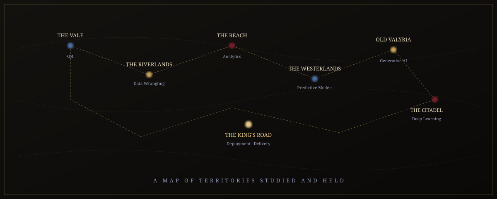
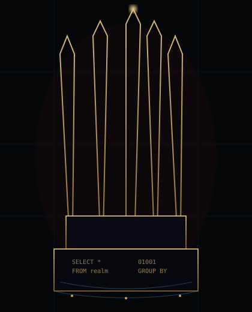

<!--
  ⚠ CONTENT-ACCURACY FLAG (read before publishing):
  The previous README's typing-animation line included "Garrisoned at Safal Infosoft."
  I did not carry that forward automatically — confirm whether this is still current
  before adding it back, since you mentioned you're now actively job hunting.
  Nothing else below invents new titles, stats, or achievements beyond your original README.
-->

<div align="center">



<br/>


<br/><br/>

[](https://github.com/Faizan-Makki)
[](https://www.linkedin.com/in/faizan-makki/)
[](https://x.com/faizan_makki)

</div>

<br/>

<div align="center"></div>

<br/>

<table align="center" width="100%"><tr>
<td width="18%" align="center"></td>
<td width="82%">

### The Sigil

*A raven for knowledge that travels. A crown of light for the systems it serves. Nodes and wires in place of feathers — because in this house, intelligence is gathered, carried, and delivered like a message that must not be lost.*

**Faizan Ahmed** — Data & AI · IIT Madras B.S. in Data Science & Applications · Ahmedabad, India

</td>
</tr></table>

<br/>

<div align="center"></div>

<br/>


<div align="left">
  
</div>


<sub><i>A map of the territories I have studied and now hold.</i></sub>

<br/>

<div align="center">

</div>

<br/>

<div align="center">

| Territory | Domain | Sigil (Stack) |
|:--|:--|:--|
| **The Vale** | Structured data, SQL Server, database architecture | `SQL` · `T-SQL` · `PostgreSQL` |
| **The Riverlands** | Data wrangling, cleaning, transformation | `Pandas` · `NumPy` |
| **The Reach** | Analytics, visualization, harvest of insight | `Plotly` · `Matplotlib` · `Power BI` |
| **The Westerlands** | Predictive systems, forecasting, forged models | `Scikit-learn` · `LightGBM` |
| **The Citadel of Deep Learning** | Neural architectures, still under apprenticeship | `PyTorch` |
| **Old Valyria** | LLMs, generative systems, emerging power | `LLM APIs` · `Generative AI` |
| **The King's Road** | Delivery, deployment, the path work travels on | `Streamlit` · `FastAPI` |
| **The Small Council** | Version control, tools of governance | `Git` · `GitHub` |

</div>

<br/>

<div align="center"></div>

<br/>

## ⚔️ &nbsp; THE IRON ARMORY

<sub><i>What I carry into battle against disorder and noise.</i></sub>

<br/>

<table align="center" width="100%">
<tr>
<td width="20%" align="center">⚔️<br/><b>THE BLADE</b><br/><sub>Languages</sub></td>
<td width="80%">

**Python** — precise, versatile, the weapon drawn first.
**SQL / T-SQL** — the query is the strike; the schema, the stance.


</td>
</tr>
<tr>
<td align="center">🛡️<br/><b>THE SHIELD</b><br/><sub>Core Libraries</sub></td>
<td>

**Pandas / NumPy** — structure held against the chaos of raw data.
**Scikit-learn** — the ward against overfit and false pattern.


</td>
</tr>
<tr>
<td align="center">🏹<br/><b>THE BOW</b><br/><sub>Predictive Craft</sub></td>
<td>

**LightGBM / PyTorch** — the long-range strike, forecasting what hasn't happened yet.


</td>
</tr>
<tr>
<td align="center">🔥<br/><b>THE DRAGONFIRE</b><br/><sub>Generative AI</sub></td>
<td>

**LLM APIs (Groq / LLaMA 3.3 70B)** — power that reshapes what's possible, used carefully.


</td>
</tr>
<tr>
<td align="center">⚙️<br/><b>WAR MACHINES</b><br/><sub>Tools & Infra</sub></td>
<td>

**FastAPI · Streamlit · PostgreSQL · SQL Server · Git** — the engines that carry work from idea to delivery.


</td>
</tr>
<tr>
<td align="center">📜<br/><b>ANCIENT KNOWLEDGE</b><br/><sub>Foundations</sub></td>
<td>

Mathematics · Statistics · Algorithms · Data Structures

</td>
</tr>
</table>

<br/>

<div align="center"></div>

<br/>

## 🏰 &nbsp; THE WAR ROOM

<sub><i>Campaigns waged, strongholds raised.</i></sub>

<br/>

<table align="center" width="100%">
<tr>
<td width="33%" valign="top">

<div style="border:1px solid #c9a35d; padding:14px; border-radius:6px;">

**🔥 CALCUTTA ANALYTICS**
*Primary Stronghold*

**Status:** 👑 Deployed
**Stack:** `Python` `Streamlit` `Plotly` `SQL Server` `Supabase`

Full-stack analytics platform for data cleaning, visualization, and AI-assisted insight generation.

[View Stronghold →](https://github.com/Faizan-Makki/Calcutta-Analytics)
[Live App →](https://calcutta-analytics-v2.streamlit.app)

</div>
</td>
<td width="33%" valign="top">

<div style="border:1px solid #c9a35d; padding:14px; border-radius:6px;">

**❄️ SALES FORECASTING**
*Campaign*

**Status:** ⚔️ Active
**Stack:** `LightGBM` `PyTorch` `Python`

Forecasting system built to predict the tides of commerce before they turn.

[View Stronghold →](https://github.com/Faizan-Makki/sales-forecasting-lightgbm-pytorch)

</div>
</td>
<td width="33%" valign="top">

<div style="border:1px solid #c9a35d; padding:14px; border-radius:6px;">

**🐦 INTELLISYS**
*Experimental Project*

**Status:** 🔥 Forging
**Stack:** `Python` `LLaMA 3.3 70B` `AI/LLM Integration`

An intelligent system project exploring applied AI capability via the Groq API.

[View Stronghold →](https://github.com/Faizan-Makki/intellisys)

</div>
</td>
</tr>
</table>

<br/>

<div align="center"></div>

<br/>

## 👑 &nbsp; THE CITADEL — *Calcutta Analytics*

<sub><i>My primary seat of power. Where every other campaign draws its resources.</i></sub>

<br/>

<div align="center">
<table width="90%">
<tr><td>

**Overview**
Calcutta Analytics is a multi-page analytics platform built to take raw, unstructured data and return it as clean, navigable insight — combining a modern data-app interface with an AI-assisted analysis layer, backed by Groq's LLaMA 3.3 70B.

<br/>

**Tech Stack**
`Python` · `Streamlit` · `Plotly` · `SQL Server` · `Supabase` · `Groq / LLaMA 3.3 70B`

<br/>

**What It Does**
- Ingests and cleans raw datasets
- Generates interactive visual analysis via Plotly
- Connects to relational databases for live querying (MS SQL Server / Supabase)
- Uses an AI backend to assist with data interpretation

<br/>

**Architecture**

```text
                RAW DATA
                    │
           ┌────────▼────────┐
           │ INGESTION LAYER │
           └────────┬────────┘
                    │
           ┌────────▼────────┐
           │ CLEANING ENGINE │   Pandas / NumPy
           └────────┬────────┘
                    │
       ┌────────────┴────────────┐
       ▼                         ▼
  ANALYTICS                 AI ENGINE
  (Plotly)             (Groq · LLaMA 3.3 70B)
       │                         │
       └────────────┬────────────┘
                    ▼
             STREAMLIT UI
                    │
                    ▼
           INSIGHTS / EXPORT
```

**Status:** 👑 Deployed &nbsp;|&nbsp; **Repository:** [Calcutta-Analytics](https://github.com/Faizan-Makki/Calcutta-Analytics) &nbsp;|&nbsp; **Live:** [calcutta-analytics-v2.streamlit.app](https://calcutta-analytics-v2.streamlit.app)

</td></tr>
</table>
</div>

<br/>

<div align="center"></div>

<br/>

## 🐉 &nbsp; THE DRAGON'S LAIR — Generative AI

<sub><i>Power that must be understood before it is wielded.</i></sub>

<br/>

<div align="center">

</div>

I'm building applied AI capability the way one earns dragonfire — piece by piece, not by accident. That means wiring LLM APIs (Groq, LLaMA 3.3 70B) into real tools like Calcutta Analytics and IntelliSys, learning where generative systems help interpretation and where they get in the way, and pairing that with PyTorch fundamentals so the "magic" stays explainable rather than mysterious.

<br/>

<div align="center"></div>

<br/>

## 📜 &nbsp; THE MAESTERS' ARCHIVE

<sub><i>The path of study I walk, link by link.</i></sub>

<br/>

<div align="center">

```text
FOUNDATION  ──────►  APPRENTICE  ──────►  SCHOLAR  ──────►  MAESTER
   SQL              Data Analytics      Machine Learning     AI Engineering
 Statistics           Power BI          Deep Learning       Generative AI
```

</div>

**Currently under study:**
- Machine Learning & Deep Learning fundamentals
- PyTorch for applied neural networks
- Generative AI & LLM-based systems
- Data Structures & Algorithms
- Advanced Data Analytics

<br/>

<div align="center"></div>

<br/>

## 🐦‍⬛ &nbsp; THE NIGHT'S WATCH

<sub><i>I keep watch at the edge of what I already know.</i></sub>

<br/>

<div align="center">

</div>

<details>
<summary><b>Current Vigil — What I'm Exploring Now</b></summary>
<br/>

- Deepening PyTorch fluency for applied deep learning
- Expanding Generative AI / LLM application work
- Strengthening Data Structures & Algorithms for technical interviews
- Refining forecasting systems with LightGBM
- Continued build-out of the Calcutta Analytics platform

</details>

<br/>

<div align="center"></div>

<br/>

## 🏛️ &nbsp; THE GREAT HOUSES

<sub><i>The disciplines I've sworn myself to, each with its own creed.</i></sub>

<br/>

<div align="center">

| House | Sigil | Motto |
|:--|:--:|:--|
| **House SQL** | 🔷 | *"What is queried well is never lost."* |
| **House Python** | 🟡 | *"Simple in hand, limitless in reach."* |
| **House Analytics** | 🔶 | *"Numbers whisper truths words cannot."* |
| **House Machine Learning** | ⚙️ | *"We do not guess — we learn the pattern."* |
| **House AI** | 🔺 | *"Beyond the wall of the known, we still build."* |

</div>

<br/>

<div align="center"></div>

<br/>

## ⚜️ &nbsp; THE BLOODLINE

<sub><i>The line of my training, from first oath to current post.</i></sub>

<br/>

```text
IIT Madras — B.S. in Data Science & Applications
        │
        ▼
    SQL Developer — Safal Infosoft Limited
        │
        ▼
    SQL  →  Data Analytics  →  Machine Learning  →  Deep Learning  →  AI
```

<br/>

<div align="center"></div>

<br/>

## 🔥❄️ &nbsp; THE IRON THRONE

<sub><i>The seat I mean to earn — not through conquest, but through mastery.</i></sub>

<br/>

<div align="center">


<br/>

```text
              DATA
               ↓
           ANALYTICS
               ↓
        MACHINE LEARNING
               ↓
         DEEP LEARNING
               ↓
     ARTIFICIAL INTELLIGENCE
               ↓
       INTELLIGENT SYSTEMS
```

**The goal is not the throne itself — it is becoming the one capable of holding it.**

</div>

<br/>

<div align="center"></div>

<br/>

## 📊 &nbsp; THE CHRONICLES

<sub><i>A record of campaigns fought, kept by the realm itself.</i></sub>

<br/>

<div align="center">

<a href="https://github.com/Faizan-Makki">
  
</a>

</div>

<br/>

<div align="center"></div>

<br/>

## 🐦 &nbsp; THE CROW'S MESSAGES

<sub><i>Send a raven — it will reach me.</i></sub>

<br/>

<div align="center">

[](https://github.com/Faizan-Makki)
[](https://www.linkedin.com/in/faizan-makki/)
[](https://x.com/faizan_makki)

<br/><br/>

<i>"Winter teaches patience. Data teaches precision. I have made room for both."</i>

</div>


